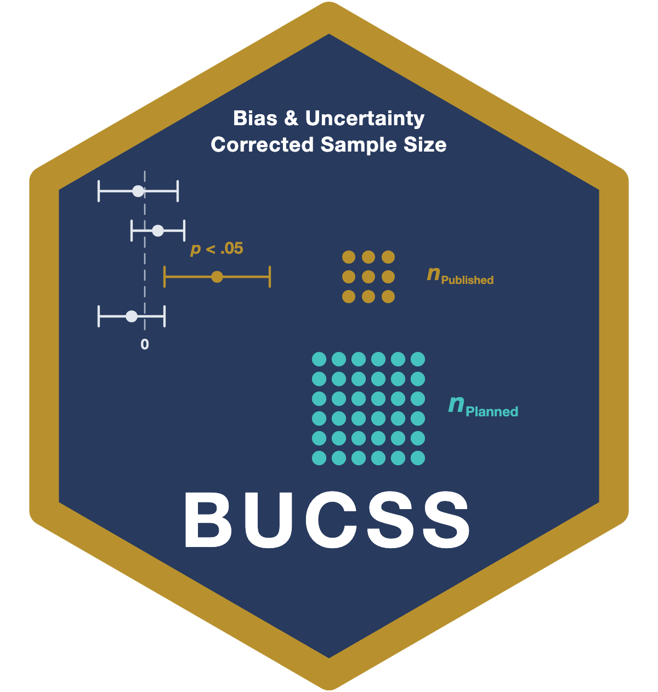

# BUCSS 

<!-- badges: start -->
[](https://github.com/yelleKneK/BUCSS/actions/workflows/R-CMD-check.yaml)
[](https://CRAN.R-project.org/package=BUCSS)
[](https://CRAN.R-project.org/package=BUCSS)
[](https://lifecycle.r-lib.org/articles/stages.html#stable)
<!-- badges: end -->

BUCSS is an R package for implementing Bias and Uncertainty Corrected Sample
Size planning. BUCSS implements a method of correcting for publication bias and
uncertainty when planning the sample size of a future study from an original
study. See [Anderson, Kelley, &amp; Maxwell (2017; *Psychological Science*, *28*, 1547--1562)](https://www3.nd.edu/~kkelley/publications/articles/Anderson_Kelley_Maxwell_Psychological_Science_2017.pdf).

## Installing `BUCSS`

Install the released version from CRAN:

``` r
install.packages("BUCSS")
```

Then load the package:

``` r
library(BUCSS)
```

The `ss_buc_*` function family described below is the current BUCSS interface
(introduced in 2.0.0). Until it reaches CRAN, install the development version
from GitHub to use these names:

``` r
# install.packages("remotes")
remotes::install_github("yelleKneK/BUCSS")
```

## Using `BUCSS`

Consider an original study in which two independent groups are used to test the
null hypothesis of no difference in the population means of the two groups
(e.g., a treatment and a control group). Suppose the independent samples
$t$-test in the original study reported $t=3.00$ based on sample sizes per group
of $n_1=50$ and $n_2=55$ with a Type I error rate of $\alpha=.05$. The planned
study seeks a statistical power of .80 with 90% assurance that the power will be
at least 80%. Assurance is the probability that a study planned with this method
will reach or surpass the desired level of statistical power. Note that an
assurance of .5 corrects for publication bias only, whereas assurance $> .5$
also corrects for uncertainty.

``` r
ss_buc_independent_t(t_observed = 3, n = c(50, 55), alpha_prior = .05,
               alpha_planned = .05, power = .80, assurance = .90)
```

This yields a necessary sample size of $n_1=n_2=1485$ per group (i.e.,
$N=n_1+n_2=2970$). The 2017 paper reported 1482 for this example under the
original grid-search method; as of BUCSS 2.0.0 the bias and uncertainty adjusted
noncentrality parameter is found by direct root finding, which gives 1485 (see
`NEWS.md`).

The functions return a tidy object of class `bucss_power`. It prints a readable
summary, and because it is an ordinary `data.frame` underneath you can pull the
two quantities out directly:

``` r
result <- ss_buc_independent_t(t_observed = 3, n = c(50, 55), power = .80,
                         assurance = .90)

result$value[result$term == "necessary_sample_size"]  # 1485
result$value[result$term == "ncp_adjusted"]           # adjusted noncentrality
```

For a programmer-friendly view, the broom verbs give the convenient shapes (as
in the [`DMAR`](https://github.com/yelleKneK/DMAR) package): `tidy()` returns a
one-row data frame with one column per quantity, so you pull a value out by
name, and `glance()` returns a one-row summary:

``` r
tidy(result)$necessary_sample_size  # 1485
tidy(result)                        # necessary_sample_size, total_N, ncp_adjusted, ...
glance(result)
```

## A note on function names

BUCSS 2.0.0 renamed the function family to the `ss_buc_*` prefix (for example
`ss_buc_independent_t()` in place of the former `ss.power.it()`), so the names make
clear that these planners apply the bias and uncertainty correction, rather than
ordinary power analysis. The independent and paired *t* test planners also carry
effect-size aliases (`ss_buc_smd()` and `ss_buc_smd_paired()`), and the
between-subjects ANOVA is now split into a one-way planner
(`ss_buc_one_way_anova()`) and a two-way planner (`ss_buc_factorial_anova()`).
Each function returns a tidy `bucss_power` object rather than a two-element list.

The old dotted names are retained for backward compatibility. As of BUCSS 2.0.0
each one (for example `ss.power.it()`) is **deprecated**: it still runs, but it
forwards to its `ss_buc_*` replacement and issues a one-time-per-session warning
naming the new function. The object it returns keeps the 1.x positional
extraction working, so legacy code that reads `result[[1]]` (the necessary
sample size) and `result[[2]]` (the adjusted noncentrality parameter) continues
to work unchanged. New code should call the `ss_buc_*` functions directly. See
the `NEWS.md` file for the full list of changes.

## Citing `BUCSS`

If you use BUCSS, please cite the package, which credits the software, its
authors, and the version you used:

> Kelley, K., Anderson, S. F., &amp; Maxwell, S. E. (2026). *BUCSS: Bias and
> Uncertainty Corrected Sample Size* (R package version 2.0.0).
> <https://CRAN.R-project.org/package=BUCSS>

For the full set of references, including the methodological articles the
correction relies on, run `citation("BUCSS")` in R.
