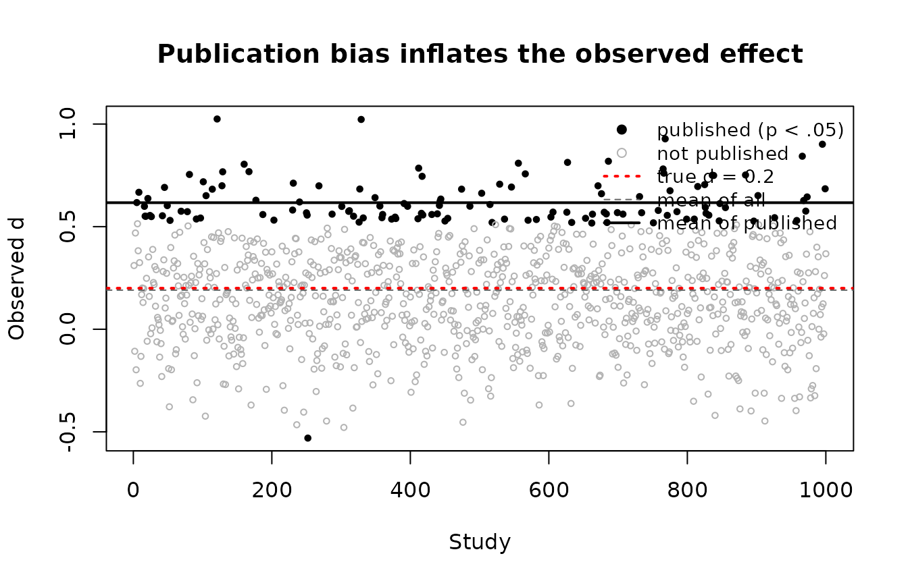

# Planning Replication Studies

This vignette is adapted from a graduate seminar exercise. It builds up,
step by step, the problem that BUCSS exists to solve: when a research
literature is built from underpowered studies, the effect sizes that get
published are systematically too large, so a replication planned from a
published result is itself underpowered, often badly. We first reproduce
that problem with a small simulation, then show how the bias and
uncertainty correction repairs the sample size plan.

``` r

library(BUCSS)
```

## A Literature Built From Underpowered Studies

Imagine a true effect that is real but small. Many laboratories run a
two-group experiment to detect it, each with a modest sample size, and
(as is the norm) only the statistically significant results find their
way into print. We can watch this happen by simulating it.

The true standardized mean difference is `d = 0.2` (Cohen’s “small”).
Each study uses 30 participants per group. We run 1000 such studies and
keep track of which ones reach `p < .05`.

``` r

set.seed(2017)

true_d <- 0.2     # the true (small) population effect
n      <- 30      # participants per group in each study
G      <- 1000    # number of studies the field runs

studies <- replicate(G, {
  control   <- rnorm(n, mean = 0,      sd = 1)
  treatment <- rnorm(n, mean = true_d, sd = 1)
  tt <- t.test(treatment, control, var.equal = TRUE)
  # For equal n per group, Cohen's d = t * sqrt(2 / n).
  c(t = unname(tt$statistic), p = tt$p.value,
    d = unname(tt$statistic) * sqrt(2 / n))
})
studies <- as.data.frame(t(studies))
studies$published <- studies$p < .05
```

How often does a single study detect this effect? That is just its
statistical power, and it is low:

``` r

power.t.test(delta = true_d, n = n, sig.level = .05)$power
#> [1] 0.1154342
mean(studies$published)   # the simulated proportion that "got published"
#> [1] 0.126
```

About one study in nine reaches significance. Now compare the average
effect size across *all* studies with the average across only the
*published* ones:

``` r

c(all       = mean(studies$d),
  published = mean(studies$d[studies$published]))
#>       all published 
#> 0.1904788 0.6166919
```

The average across all studies sits near the truth of 0.2. The average
across published studies is far larger, because a small study can only
clear the significance filter when its sample effect happens to land
high. The filter does not select for true effects; it selects for large
*estimates*. This is publication bias, and the figure makes it vivid.



The published effects (filled points) are a biased sample of the truth:
their average (solid line) is well above the true value (dashed red
line). A reader of this literature sees only the filled points and
naturally concludes the effect is much larger than it is.

## Why Planning at Face Value Underpowers the Replication

Now put yourself in the position of a researcher who wants to replicate
one of these published findings. Suppose the published study you are
working from used 25 participants per group and reported `t = 2.52`.
Taken at face value, that implies a healthy effect size:

``` r

t_obs  <- 2.52
n_prior <- 25
d_face  <- t_obs * sqrt(2 / n_prior)
d_face
#> [1] 0.7127636
```

If you plan a replication for 80% power using that face-value effect,
you need only a modest sample:

``` r

n_naive <- ceiling(power.t.test(delta = d_face, power = .80, sig.level = .05)$n)
n_naive
#> [1] 32
```

But the effect was never really that large; it is one of the inflated
published estimates. If the truth is `d = 0.2`, the power your
replication actually has at that sample size is dismal:

``` r

power.t.test(delta = 0.2, n = n_naive, sig.level = .05)$power
#> [1] 0.1205391
```

You planned for 80% power and bought yourself about 12%. Planning at
face value does not just lose a little power; it leaves the replication
almost as underpowered as the original. A field that plans this way
keeps running studies that cannot succeed.

## The BUCSS Correction

BUCSS breaks this cycle. Instead of trusting the published effect, it
treats the published test statistic as a draw from a *truncated*
distribution, truncated because only significant results were
publishable, and corrects for both the publication bias and the sampling
uncertainty before planning. The same prior study, run through
[`ss_buc_independent_t()`](https://yelleKneK.github.io/BUCSS/reference/ss_buc_independent_t.md),
asks for a very different sample size.

We use `assurance = .50` first. An assurance of .50 corrects for
publication bias only: it asks for the sample size that gives the target
power on average across replications.

``` r

ss_buc_independent_t(t_observed = 2.52, n = 25,
                     alpha_prior = .05, alpha_planned = .05,
                     assurance = .50, desired_power = .80)
```

| term                  | value |
|:----------------------|:------|
| necessary_n_per_group | 109   |
| total_N               | 218   |
| actual_power          | 0.801 |
| ncp_adjusted          | 1.35  |
| t_observed            | 2.52  |
| n                     | 25    |
| alpha_prior           | 0.05  |
| alpha_planned         | 0.05  |
| assurance             | 0.5   |
| desired_power         | 0.8   |

Design: Independent t test; Sample size unit: per group; Largest
supportable assurance: .69

Even correcting for publication bias alone, BUCSS calls for far more
participants per group than the naive plan of 32. The face-value plan
was not cautious; it was wishful.

Raising the assurance above .50 also corrects for *uncertainty*: it asks
for the sample size that will reach the target power not just on average
but in a stated proportion of replications. With a prior study this
small, however, asking for high assurance reveals a hard truth. The
original study simply did not carry enough information, and BUCSS says
so rather than returning a falsely precise number:

``` r

ss_buc_independent_t(t_observed = 2.52, n = 25,
                     alpha_prior = .05, alpha_planned = .05,
                     assurance = .80, desired_power = .80)
#> Error:
#> ! Sample size planning is not possible with these settings. After correcting the prior study's effect for publication bias and uncertainty at the requested level of assurance, the corrected noncentrality parameter is zero, which means there is not enough information in the prior result to plan the sample size as desired. With this prior result and 'alpha_prior', the largest 'assurance' that still yields a usable plan is about .69; re-run with 'assurance' at or below that value, or raise 'alpha_prior' to lift the ceiling. Re-running at a lower 'assurance' is not free: the plan it returns carries that lower assurance, not the one you first asked for, so the long run proportion of replications reaching your target power falls accordingly. 'alpha_prior' does not change the prior study, which is what it is; it is your assumption about the publication threshold the study's literature faced, so raising it toward 1 assumes less publication bias to undo (for example, 'alpha_prior = .10' assumes the literature's journals would have published a result significant at the .10 level, a more lenient policy than .05, and 'alpha_prior = 1' assumes no publication bias at all). See Anderson, Kelley, and Maxwell (2017) and Anderson and Kelley (2024).
```

The message is itself the lesson: an underpowered original study cannot
anchor a high-assurance replication. It tells you the largest assurance
this prior can support and the two levers you can pull (lower the
assurance, or raise `alpha_prior` to assume the literature filtered less
aggressively), so you can make an informed, minimal adjustment rather
than a blind one. A well-powered original study would support assurance
of .80 or .95 comfortably; this one does not, and that is worth knowing
before you collect data.

## Reading and Using the Result

Every `ss_buc_*` function returns a tidy object. Print it for a readable
summary, or pull the pieces out programmatically:

``` r

plan <- ss_buc_independent_t(t_observed = 2.52, n = 25, assurance = .50)
tidy(plan)
#>          term estimate     power
#> 1 sample_size      109 0.8013533
tidy(plan)$estimate
#> [1] 109
```

The classic dotted name still works for scripts written against earlier
versions of BUCSS, and the first two elements of the result remain the
sample size and the adjusted noncentrality parameter, exactly as they
were:

``` r

legacy <- suppressWarnings(ss.power.it(t.observed = 2.52, N = 50, assurance = .50))
legacy[[1]]   # necessary sample size per group
#> [1] 109
```

(Calling the dotted name once per session also prints a deprecation note
pointing to
[`ss_buc_independent_t()`](https://yelleKneK.github.io/BUCSS/reference/ss_buc_independent_t.md);
new code should use the new name.)

## The Bigger Picture

Detecting the effect again is only one possible goal of a replication.
Anderson and Kelley (2024) describe four, each with its own sample size
logic: inferring that the effect exists (the goal above, served by
BUCSS), inferring that the effect is so small it is essentially null
(equivalence testing), estimating the effect’s magnitude precisely
(accuracy in parameter estimation, as in the MBESS package), and
planning the next study to sharpen a running meta-analytic estimate. The
common thread is that the design choice comes first: decide what a
successful replication would mean, then plan the sample size for that,
and never take a published effect size at face value.

## References

Anderson, S. F., & Kelley, K. (2024). Sample size planning for
replication studies: The devil is in the design. *Psychological Methods,
29*, 844–867. <https://doi.org/10.1037/met0000520>

Anderson, S. F., & Maxwell, S. E. (2017). Addressing the “replication
crisis”: Using original studies to design replication studies with
appropriate statistical power. *Multivariate Behavioral Research, 52*,
305–324.

Anderson, S. F., Kelley, K., & Maxwell, S. E. (2017). Sample-size
planning for more accurate statistical power: A method adjusting sample
effect sizes for publication bias and uncertainty. *Psychological
Science, 28*, 1547–1562. <https://doi.org/10.1177/0956797617723724>

Maxwell, S. E., Delaney, H. D., & Kelley, K. (2027). *Designing
experiments and analyzing data: A model comparison perspective* (4th
ed.). Routledge.

Taylor, D. J., & Muller, K. E. (1996). Bias in linear model power and
sample size calculation due to estimating noncentrality. *Communications
in Statistics: Theory and Methods, 25*, 1595–1610.
