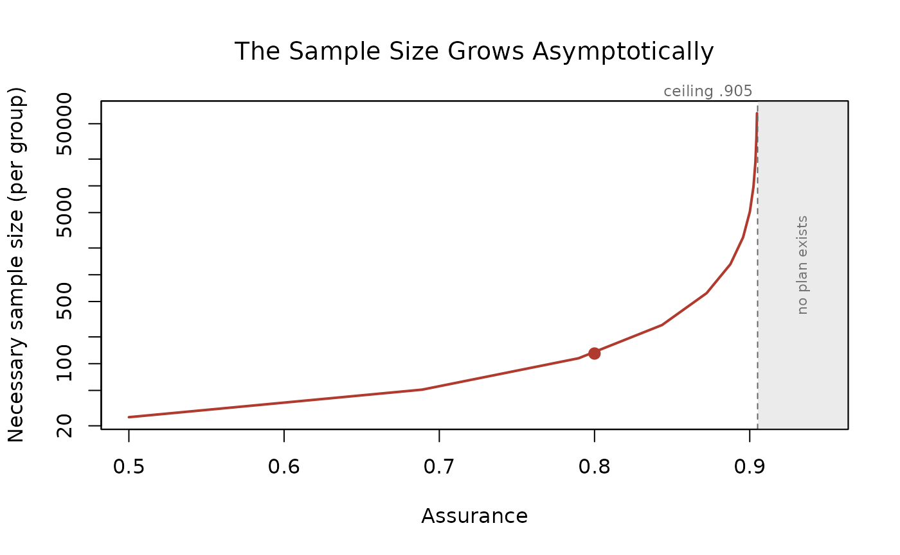

# Assurance and the Publication Bias Correction

Two settings control how aggressively BUCSS corrects the prior study’s
effect: `assurance` handles uncertainty, and `alpha_prior` handles
publication bias. This vignette explains what each one does and shows
how the recommended sample size responds as you turn each knob. The
correction is described by Anderson, Kelley, and Maxwell (2017) and
builds on the truncated noncentral distribution of Taylor and Muller
(1996).

## Assurance: Correcting for Uncertainty

Assurance is the long-run proportion of replications whose realized
power meets or exceeds the target. If you plan for 80% power with
`assurance = .80`, then in about 80% of replications the realized power
will be at least 80%.

- `assurance = .5` selects the median of the likelihood. This corrects
  for publication bias only; it does not add any cushion for
  uncertainty.
- `assurance > .5` selects a lower quantile of the likelihood, which is
  a smaller, more conservative noncentrality parameter, and therefore a
  larger planned sample size. The extra sample size is the price of
  protecting against the chance that the prior estimate was lucky.
- `assurance < .5` is not recommended (the functions warn), because it
  implies under a 50% chance of reaching the desired power.

Why does uncertainty call for a larger sample at all? Suppose for a
moment there were no publication bias, so the reported effect were
equally likely to fall above or below the true value. The two kinds of
error do not cancel, because the sample size needed for a given level of
power is a nonlinear function of the effect size. An overestimate leads
you to plan too small a study and cuts power sharply, while an equally
sized underestimate leads you to plan a larger study and raises power by
less. Averaged over the ways a noisy estimate can come out, planning at
face value loses more power than it gains, so protecting against
uncertainty means shifting the plan toward a larger sample. That is
exactly what assurance above .5 does.

Watch the recommended per-group sample size climb as assurance rises,
for a prior independent *t* test with *t* = 3.00 and 20 per group:

``` r

assurances <- c(.5, .6, .7, .8, .9)
n_by_assurance <- sapply(assurances, function(a) {
  r <- ss_buc_independent_t(t_observed = 3, n = 20, assurance = a, desired_power = .80)
  r$value[r$term == "necessary_n_per_group"]
})
data.frame(assurance = assurances, necessary_n_per_group = n_by_assurance)
#>   assurance necessary_n_per_group
#> 1       0.5                    25
#> 2       0.6                    34
#> 3       0.7                    55
#> 4       0.8                   130
#> 5       0.9                  5042
```

The climb is steep. A prior effect this uncertain calls for 130 per
group at 80% assurance and over 5000 per group at 90%.

### When the Correction Cannot Be Made

Push assurance high enough on a weak or uncertain prior effect and the
corrected noncentrality parameter is driven to zero. That is the method
telling you the prior effect cannot be estimated with confidence at this
level of assurance, so sample size planning is not possible with these
settings. The function stops rather than returning a meaningless answer,
and the error reports the largest assurance the prior result can support
so you know exactly how far to step back:

``` r

# Not run: this stops with an informative error.
ss_buc_independent_t(t_observed = 3, n = 20, assurance = .95, desired_power = .80)
#> Error: Sample size planning is not possible with these settings. After
#> correcting the prior study's effect for publication bias and uncertainty
#> at the requested level of assurance, the corrected noncentrality
#> parameter is zero, which means there is not enough information in the
#> prior result to plan the sample size as desired. With this prior result
#> and 'alpha_prior', the largest 'assurance' that still yields a usable
#> plan is about .90; re-run with 'assurance' at or below that value, or
#> raise 'alpha_prior' to lift the ceiling. Re-running at a lower
#> 'assurance' is not free: the plan it returns carries that lower
#> assurance, not the one you first asked for, so the long run proportion
#> of replications reaching your target power falls accordingly.
#> 'alpha_prior' does not change
#> the prior study, which is what it is; it is your assumption about the
#> publication threshold the study's literature faced, so raising it toward
#> 1 assumes less publication bias to undo (for example, 'alpha_prior = .10'
#> assumes the literature's journals would have published a result
#> significant at the .10 level, a more lenient policy than .05, and
#> 'alpha_prior = 1' assumes no publication bias at all). See Anderson,
#> Kelley, and Maxwell (2017) and Anderson and Kelley (2024).
```

That last sentence is worth dwelling on, because the first remedy looks
cheaper than it is. Assurance is a promise about the long run: at .90,
nine replications in ten reach your target power. If the prior result
cannot support .90 and you re-run at .80, the plan you get is a
perfectly good .80 plan, but it is an .80 plan. You have not recovered
the guarantee you wanted; you have accepted a smaller one in exchange
for a feasible study. Raising `alpha_prior` is a different kind of move:
it does not lower the guarantee, it changes an assumption about the
literature the prior study came from, and it is defensible exactly to
the extent that the assumption is.

The reported ceiling is exact: the largest assurance a prior result can
support is `1 - p/alpha_prior`, where *p* is the prior study’s *p*
value. Here that is about .90, so .95 is out of reach but .90 or below
is fine. The two remedies are exactly the two knobs: lower the assurance
to at or below the reported ceiling, or assume less publication bias by
raising `alpha_prior`, which lifts the ceiling. When the ceiling is
already at or below the .5 floor, only raising `alpha_prior` can help.

Every successful call reports this same ceiling too, printed in the
footer as “Largest supportable assurance”, so you can see how much
headroom remains before the correction breaks down. The printed result
also gives the implied total sample size for per-group and per-cell
designs, saving you the multiplication.

### The Ceiling, Drawn

The ceiling is easier to see than to read about, so
[`plot()`](https://rdrr.io/r/graphics/plot.default.html) on any plan
draws it. The method re-runs that plan’s own planner across a range of
assurance values and shows what happens on the way to the wall.

``` r

plan <- ss_buc_independent_t(t_observed = 3, n = 20, assurance = .80)
plot(plan)
```


The point is the shape. Assurance does not degrade gracefully as it
rises: it hits a wall. On the left, the corrected noncentrality
parameter, the quantity the correction actually solves for, falls to
zero. On the right, the sample size that parameter implies grows
asymptotically, and the vertical scale is logarithmic because it spans
three orders of magnitude over a range of assurance a researcher might
plausibly consider. The filled point is the plan itself, at
`assurance = .80`, and the shaded band is the region where the planner
refuses.

That the sample size is finite everywhere left of the ceiling and
undefined everywhere right of it is not an artifact of the software. It
is what the prior result can and cannot support.

Read from the same figure, the two remedies in the error message are the
two things you can do to a wall. Lowering assurance moves the point
left, along a curve that is very steep near the ceiling, which is why a
small step back can buy a large reduction in sample size. Raising
`alpha_prior` moves the wall itself to the right.

The plotted values come back invisibly, so the figure can be redrawn
with any other graphics system:

``` r

curve_values <- plot(plan, which = "size", n_points = 12)
```



``` r

head(curve_values, 4)
#>   assurance ncp_adjusted sample_size actual_power
#> 1 0.5000000    2.5934021          25    0.8108657
#> 2 0.6888979    1.7779261          51    0.8028359
#> 3 0.7897070    1.1784254         115    0.8034150
#> 4 0.8435058    0.7620142         272    0.8010077
```

## alpha_prior: Modeling Publication Bias

`alpha_prior` is the significance threshold that governs publication in
the prior study’s literature. Setting `alpha_prior = .05` assumes the
field publishes results with *p* \< .05 and truncates the likelihood at
that point. A larger value assumes a more permissive literature and
therefore less severe bias; `alpha_prior = 1` assumes no publication
bias at all, which is appropriate for a prior study that was never
subject to the file drawer, such as a pilot study.

A dissertation study is a similar case, since it is typically completed
and defended regardless of how the results turn out. Even a pilot study
is not guaranteed to be bias-free, though. If the researchers would have
gone on to the full study only after a promising pilot result, say *p*
\< .25, then the pilot faced an informal filter of its own, and an
`alpha_prior` between .05 and 1 may describe it better than either
extreme. An intermediate value above .05 also suits a prior effect that
was not the original study’s focus, such as a secondary effect reported
alongside a study’s main result, which usually faced a weaker
publication filter than the headline effect did.

Note that `alpha_prior` is not a confidence level and is distinct from
`alpha_planned`, which is the Type I error rate of the study you are
designing.

Holding assurance at .80, watch the recommended sample size shrink as we
assume less publication bias:

``` r

alphas <- c(.05, .10, .20, .50, 1)
n_by_alpha <- sapply(alphas, function(ap) {
  r <- ss_buc_independent_t(t_observed = 3, n = 20, alpha_prior = ap, assurance = .80,
                   desired_power = .80)
  r$value[r$term == "necessary_n_per_group"]
})
data.frame(alpha_prior = alphas, necessary_n_per_group = n_by_alpha)
#>   alpha_prior necessary_n_per_group
#> 1        0.05                   130
#> 2        0.10                    64
#> 3        0.20                    48
#> 4        0.50                    40
#> 5        1.00                    37
```

Assuming the strongest bias (`alpha_prior = .05`) calls for 130 per
group; assuming none (`alpha_prior = 1`) calls for 37.

## Seeing the Assurance Claim Exercised

Everything above is a claim about a long run that a user planning one
study never gets to watch.
[`ss_buc_sensitivity()`](https://yelleKneK.github.io/BUCSS/reference/ss_buc_sensitivity.md)
lets you watch it on your own numbers. It reads the design and the
planning inputs off a plan, simulates prior studies of that design from
a true effect you name, discards the ones a literature would not have
published, runs the same planner on each survivor, and reports what
happened.

You have to name the true effect; there is deliberately no default,
because defaulting to the corrected estimate would ask the method to
grade its own answer. The value goes on the same scale as the plan’s own
`ncp_adjusted`, so that number is the natural anchor.

``` r

plan <- ss_buc_paired_t(t_observed = 3, N = 30, assurance = .80)
plan$value[plan$term == "ncp_adjusted"]
#> [1] 0.9753901
ss_buc_sensitivity(plan, true_ncp = 2, replications = 2000, seed = 2017)
#>  term                     value 
#>  true_ncp                 2     
#>  ncp_adjusted             0.975 
#>  replications             2000  
#>  publication_rate         0.49  
#>  refusal_rate             0.508 
#>  attainment               0.604 
#>  attainment_mcse          0.0156
#>  attainment_with_refusals 0.806 
#>  size_at_true_effect      61    
#>  size_q25                 40    
#>  size_median              85    
#>  size_q75                 280   
#> 
#> Design: Dependent (paired) t test
#> Sample size unit: number of pairs
#> Requested assurance: .80
#> Target power: .80
```

Two attainment rates are reported, and the gap between them is the
point. `attainment_with_refusals` lands on the requested assurance,
because that is the quantity the guarantee is about: a refusal counts as
attaining, since declining to plan is the limiting case of an
arbitrarily conservative plan. `attainment` counts only the prior
studies for which a plan was actually issued, and it is lower, often
much lower. That is what a user experiences, and it is the visible price
of a method that refuses rather than guesses. Its expected value is
`(assurance - refusal_rate)/(1 - refusal_rate)`.

The most useful thing to do with this function is to run it more than
once, at the corrected estimate and at values below it, and watch how
fast the attainment falls when the truth is smaller than the correction
assumed. What it cannot tell you is whether the distributional
assumption behind a design is right, since the simulation shares that
assumption.

## Practical Guidance

- Make the corrections as minimal as you can defend. Each knob trades a
  modeling assumption for a smaller sample, and overstating either bias
  or uncertainty inflates the study unnecessarily.
- `assurance = .80` is a common, defensible choice. Reserve very high
  assurance for cases where a failed replication is especially costly,
  and expect the required sample size to grow quickly.
- Choose `alpha_prior` to reflect the publishing threshold in the prior
  study’s field. Use `alpha_prior = 1` only when you genuinely believe
  the prior study escaped publication bias.

## References

Anderson, S. F., & Kelley, K. (2024). Sample size planning for
replication studies: The devil is in the design. *Psychological Methods,
29*, 844–867. <https://doi.org/10.1037/met0000520>

Anderson, S. F., Kelley, K., & Maxwell, S. E. (2017). Sample-size
planning for more accurate statistical power: A method adjusting sample
effect sizes for publication bias and uncertainty. *Psychological
Science, 28*, 1547–1562. <https://doi.org/10.1177/0956797617723724>

Taylor, D. J., & Muller, K. E. (1996). Bias in linear model power and
sample size calculation due to estimating noncentrality. *Communications
in Statistics: Theory and Methods, 25*, 1595–1610.
